# System Architecture Diagrams - Course Registration System

## 1. Layered Architecture Diagram

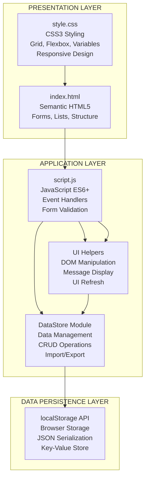

## 2. Component Architecture Diagram

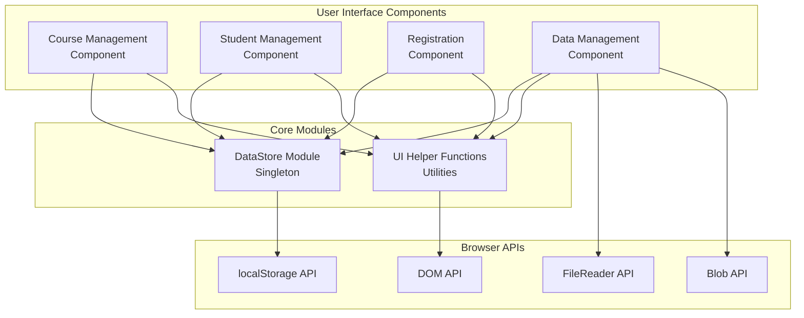

## 3. System Context Diagram (C4 Model - Level 1)

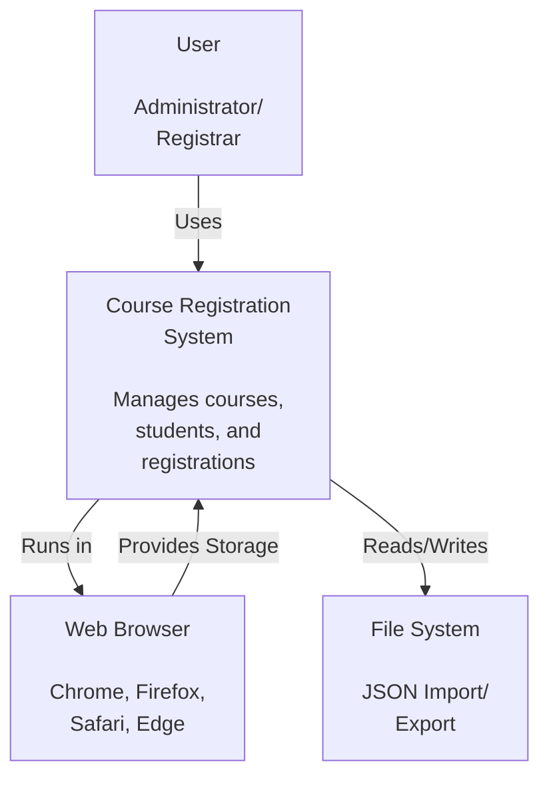

## 4. Container Diagram (C4 Model - Level 2)

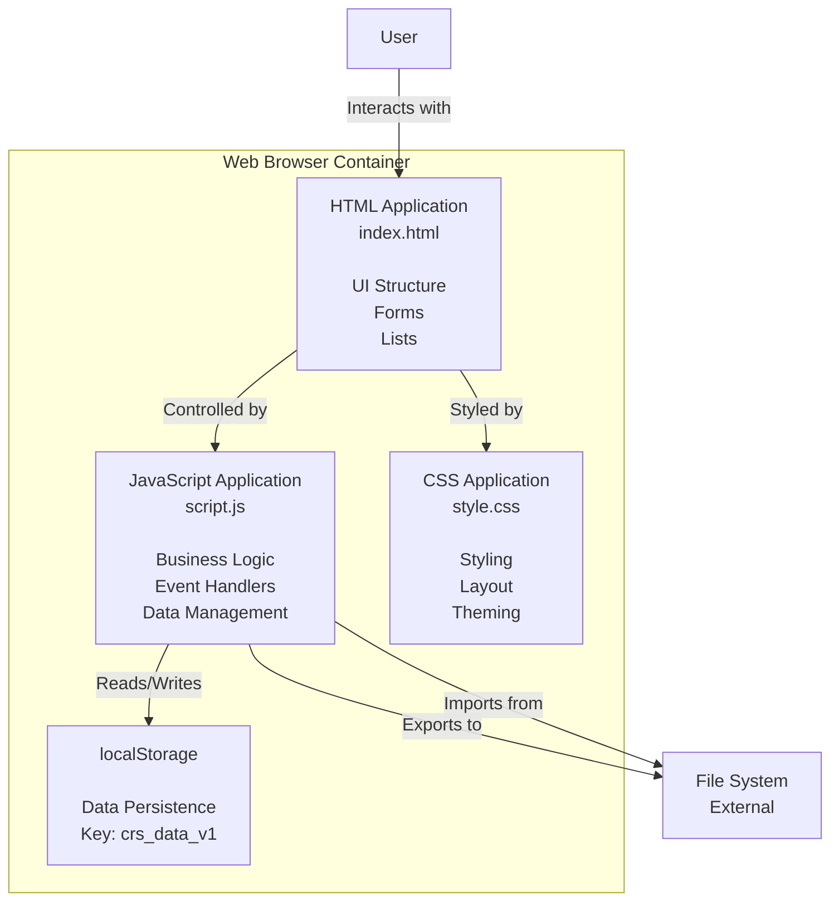

## 5. Component Diagram (C4 Model - Level 3)

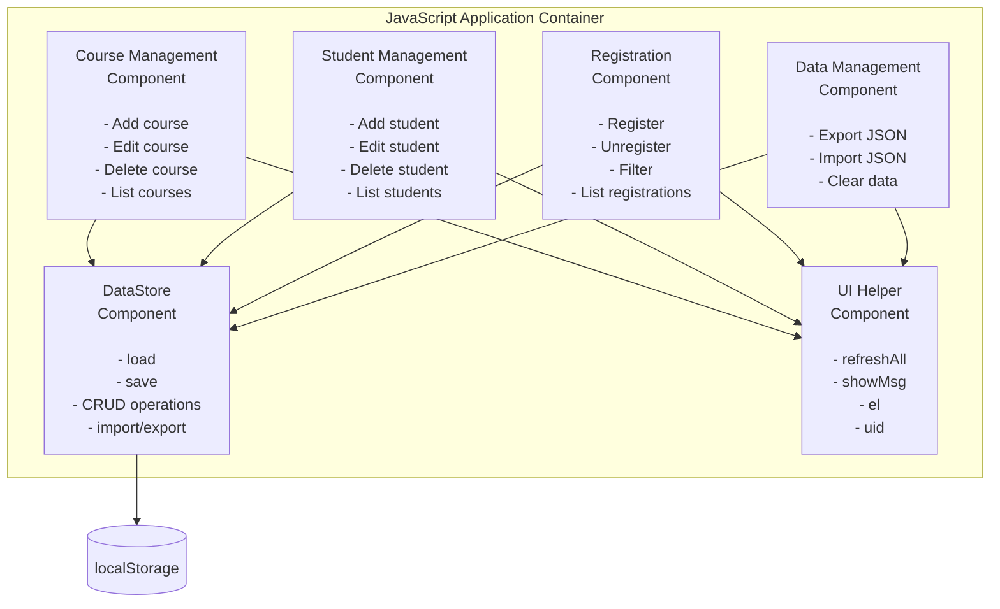

## 6. Data Flow Architecture Diagram

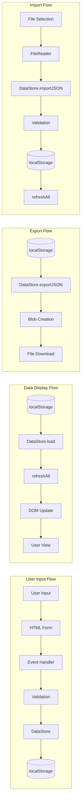

## 7. Technology Stack Diagram

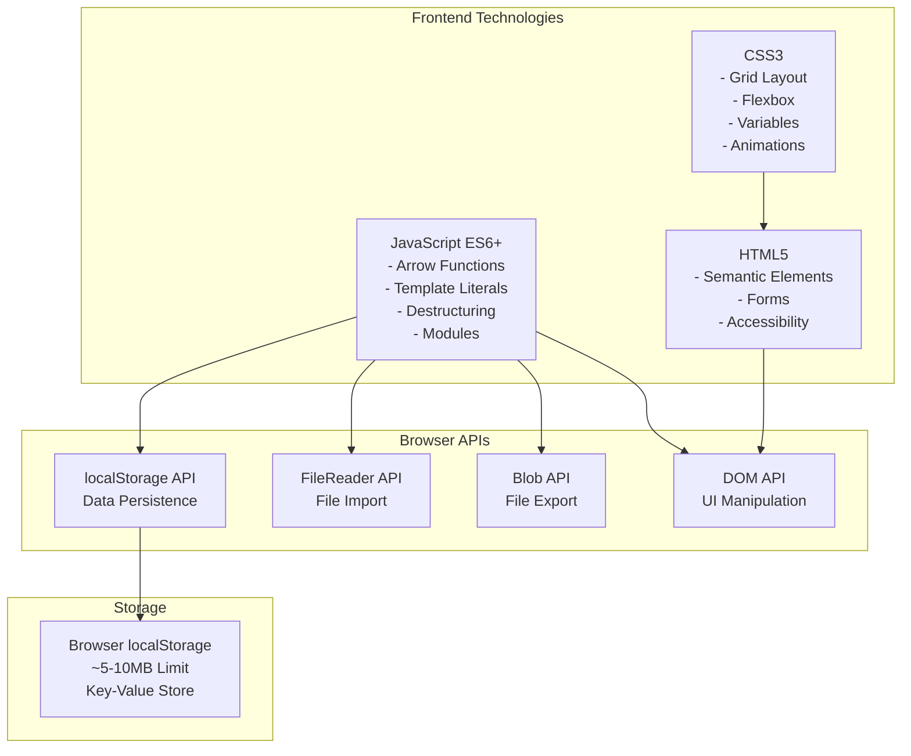

## 8. Deployment Architecture Diagram

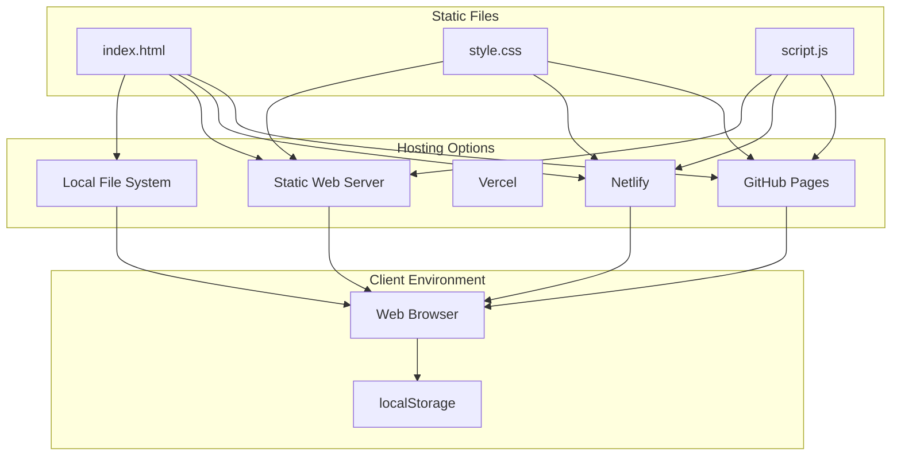

## 9. Module Dependency Diagram

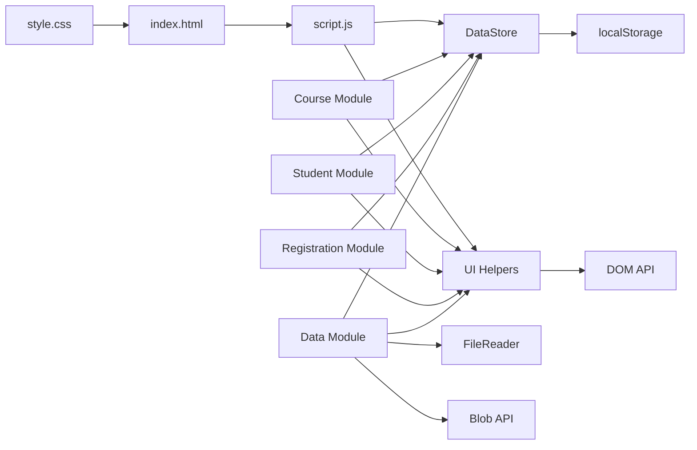

## 10. Request-Response Flow (Simplified)

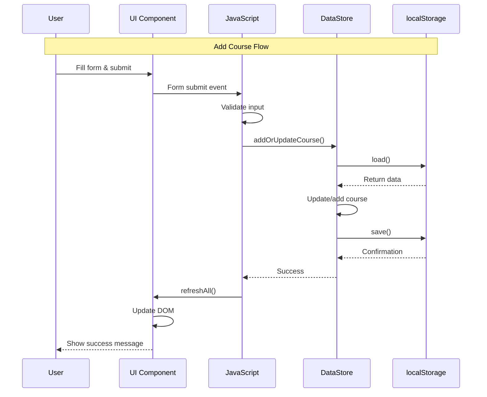

## 11. System Boundaries Diagram

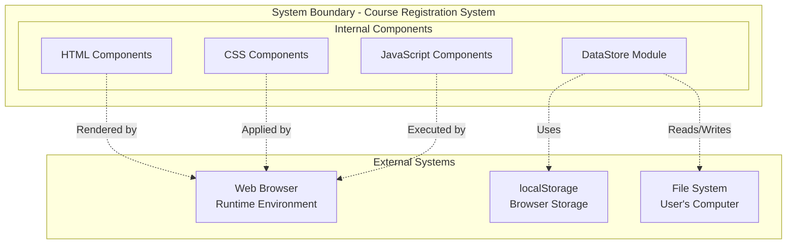

## 12. Architecture Decision Flow

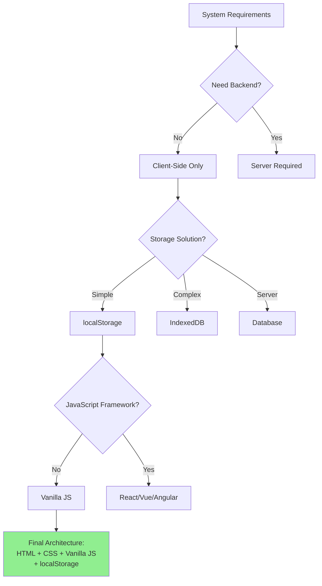

## 13. Component Interaction Diagram

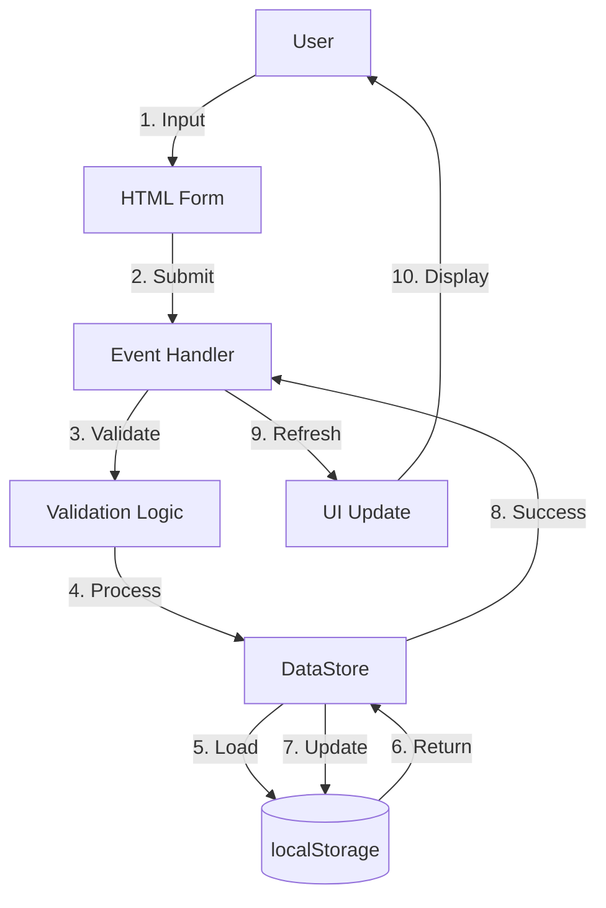

## 14. Data Model Architecture

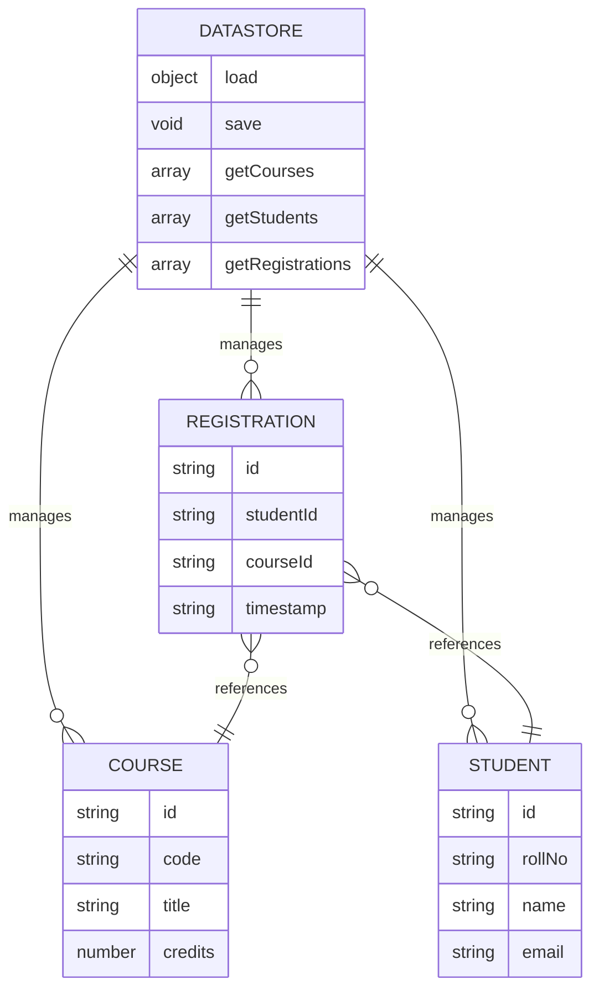

## 15. Security Architecture (Simplified)

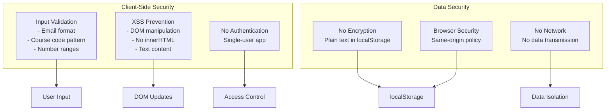

---

## How to Use These Diagrams

### Option 1: GitHub/GitLab
- These Mermaid diagrams render automatically in markdown files
- Copy into your README.md or documentation

### Option 2: Mermaid Live Editor
1. Go to https://mermaid.live
2. Copy any diagram code
3. Paste and export as PNG/SVG

### Option 3: VS Code
1. Install "Markdown Preview Mermaid Support"
2. Preview markdown to see rendered diagrams

### Option 4: Documentation Tools
- Works with Notion, Obsidian, Confluence (with plugin)

---

## Diagram Descriptions

1. **Layered Architecture**: Shows 3-layer separation (Presentation, Application, Data)
2. **Component Architecture**: Shows all system components and their relationships
3. **System Context (C4)**: High-level view of system in its environment
4. **Container Diagram (C4)**: Shows containers within the system
5. **Component Diagram (C4)**: Shows components within containers
6. **Data Flow**: Shows how data moves through the system
7. **Technology Stack**: Shows all technologies used
8. **Deployment**: Shows deployment options and structure
9. **Module Dependencies**: Shows module relationships
10. **Request-Response Flow**: Shows interaction sequences
11. **System Boundaries**: Shows what's inside vs outside the system
12. **Architecture Decisions**: Shows decision-making process
13. **Component Interaction**: Shows component communication
14. **Data Model**: Shows data structure and relationships
15. **Security Architecture**: Shows security considerations

---

## Customization Tips

- Change colors: Add theme configuration
- Add more details: Expand component descriptions
- Include error flows: Add error handling paths
- Add performance notes: Include optimization points
- Show scalability: Add scaling considerations

Example with custom theme:
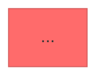

