# UML Diagrams for Course Registration System

## 1. Class Diagram

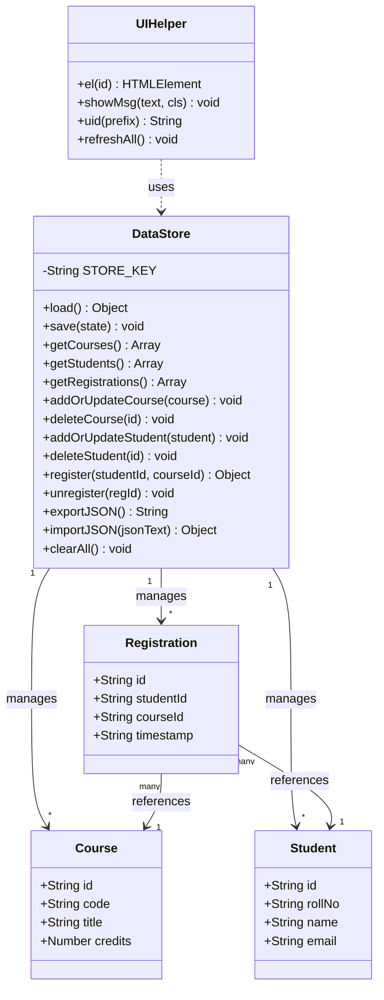

## 2. Entity Relationship Diagram (ERD)

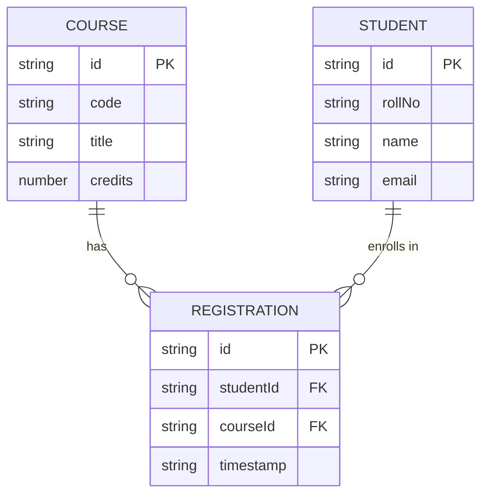

## 3. Use Case Diagram

```mermaid
graph TB
    User[User/Administrator]
    
    subgraph "Course Management"
        UC1[Add Course]
        UC2[Edit Course]
        UC3[Delete Course]
        UC4[View Courses]
    end
    
    subgraph "Student Management"
        UC5[Add Student]
        UC6[Edit Student]
        UC7[Delete Student]
        UC8[View Students]
    end
    
    subgraph "Registration Management"
        UC9[Register Student]
        UC10[Unregister Student]
        UC11[View Registrations]
        UC12[Filter Registrations]
    end
    
    subgraph "Data Management"
        UC13[Export to JSON]
        UC14[Import from JSON]
        UC15[Clear All Data]
    end
    
    User --> UC1
    User --> UC2
    User --> UC3
    User --> UC4
    User --> UC5
    User --> UC6
    User --> UC7
    User --> UC8
    User --> UC9
    User --> UC10
    User --> UC11
    User --> UC12
    User --> UC13
    User --> UC14
    User --> UC15
```

## 4. Sequence Diagram - Register Student for Course

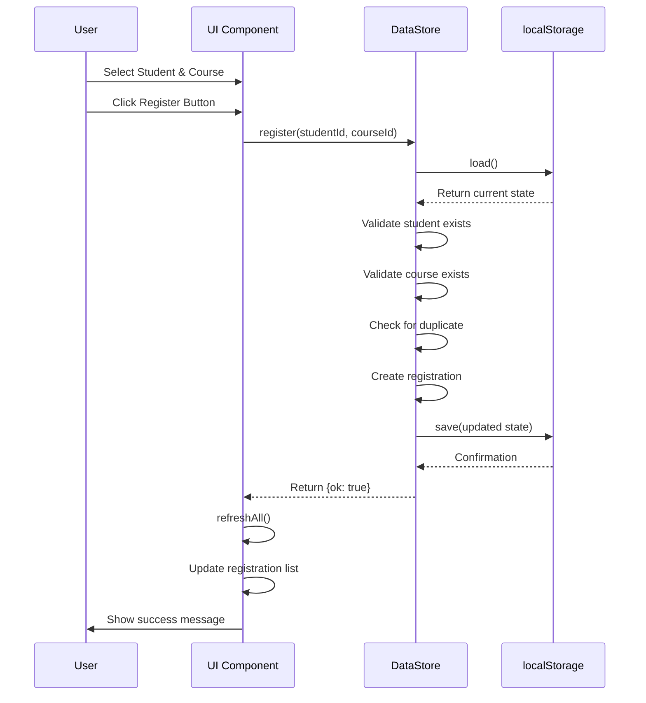

## 5. Sequence Diagram - Add Course

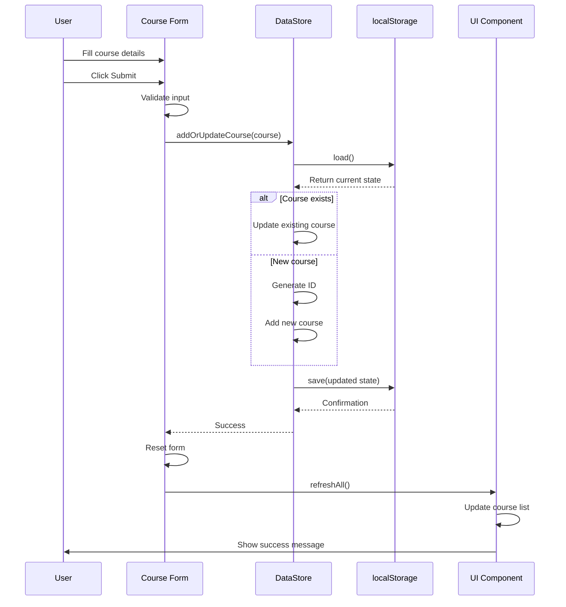

## 6. Activity Diagram - Data Import Process

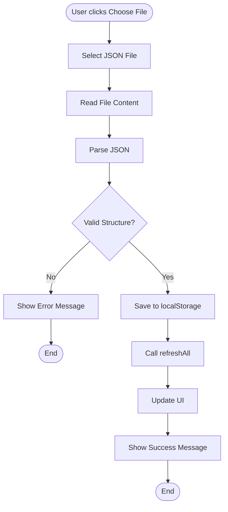

## 7. Component Diagram

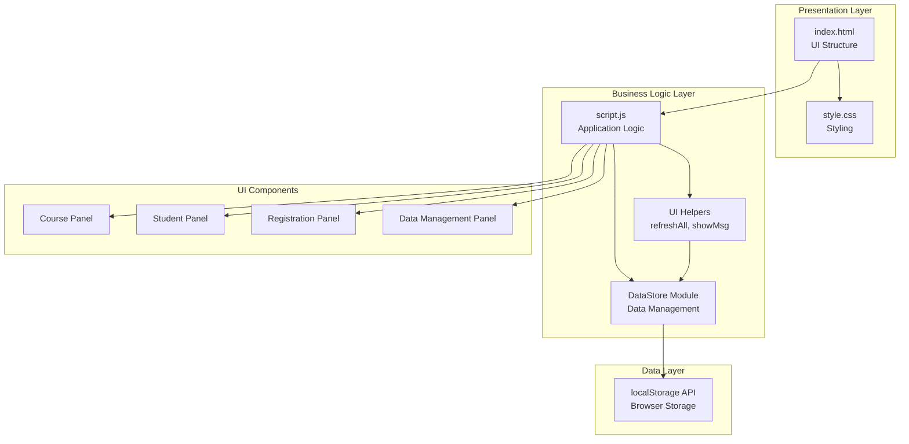

## 8. State Diagram - Registration Lifecycle

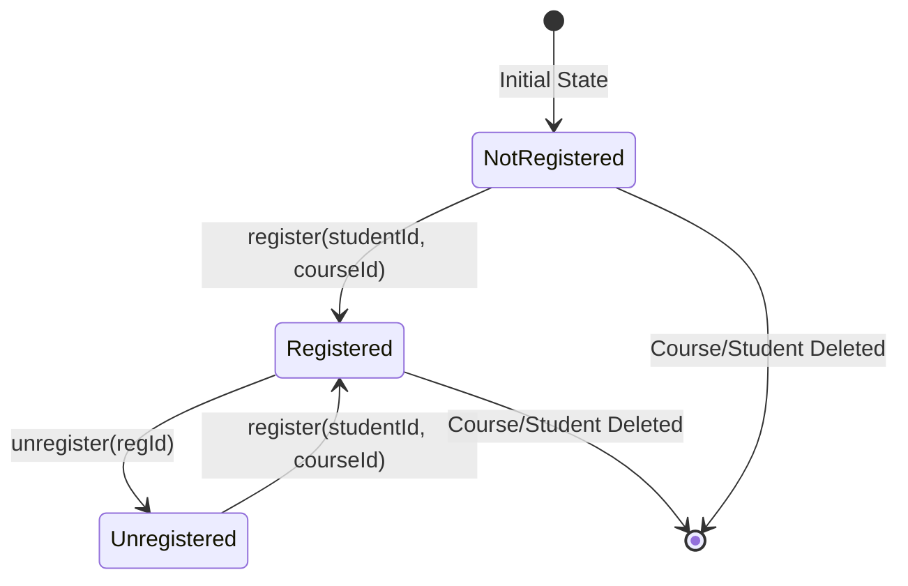

## 9. Data Flow Diagram

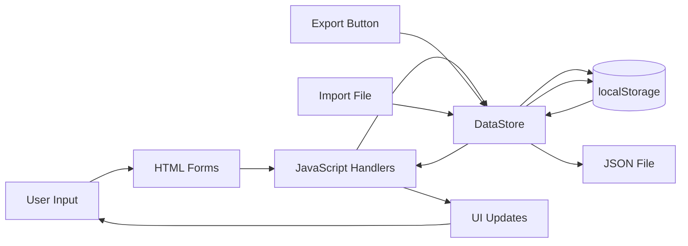

## 10. Package Diagram

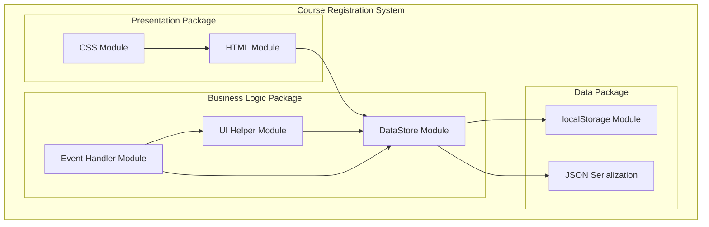

---

## How to Use These Diagrams

### Option 1: GitHub/GitLab
- These Mermaid diagrams will render automatically in markdown files on GitHub/GitLab
- Just copy the code blocks into your README.md

### Option 2: Mermaid Live Editor
1. Go to https://mermaid.live
2. Copy any diagram code
3. Paste into the editor
4. Export as PNG/SVG

### Option 3: VS Code
1. Install "Markdown Preview Mermaid Support" extension
2. Open this file in VS Code
3. Preview the markdown to see rendered diagrams

### Option 4: Documentation Tools
- These work with:
  - Notion
  - Obsidian
  - Confluence (with Mermaid plugin)
  - Many other markdown renderers

---

## Diagram Descriptions

1. **Class Diagram**: Shows the structure of classes and their relationships
2. **ERD**: Shows database-like relationships between entities
3. **Use Case Diagram**: Shows all functionality from user perspective
4. **Sequence Diagrams**: Show step-by-step interactions for key operations
5. **Activity Diagram**: Shows the flow of the import process
6. **Component Diagram**: Shows system architecture and dependencies
7. **State Diagram**: Shows how registrations change states
8. **Data Flow Diagram**: Shows how data moves through the system
9. **Package Diagram**: Shows module organization

---

## Customization

You can modify these diagrams by:
- Changing colors (add `%%{init: {'theme':'base', 'themeVariables': {...}}}%%`)
- Adding more details to classes
- Including more sequence steps
- Adding error handling paths
- Including validation steps

Example with theme:
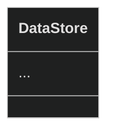

